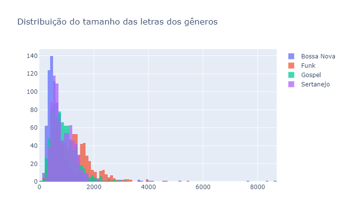
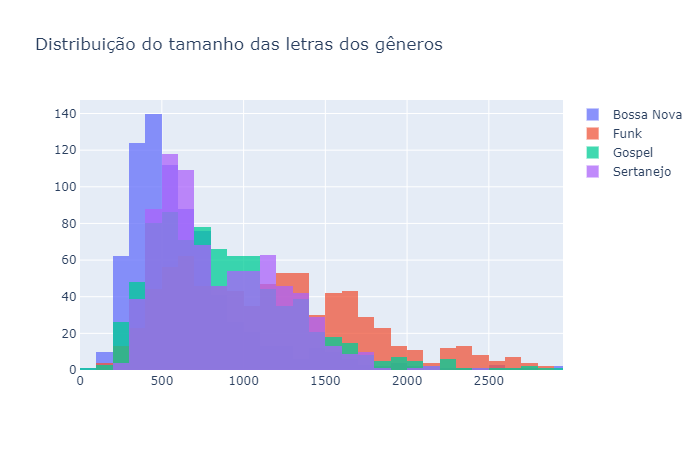
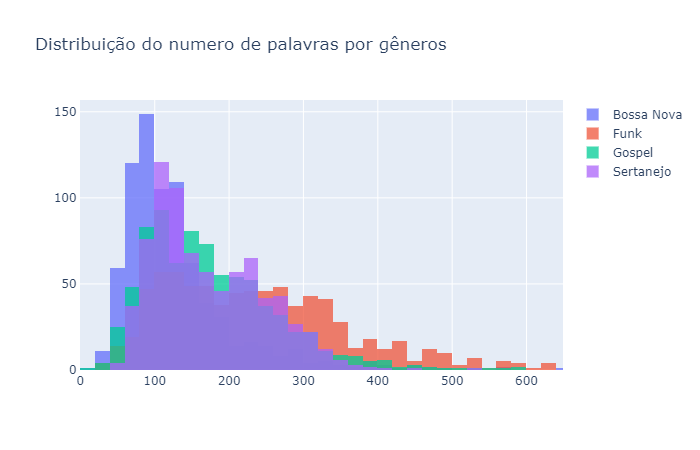

# análise exploratória do conjunto de dados de forma descritiva

Depois de limpar os dados (os notebooks estarão disponíveis no github) começei os processos de análise exploratória dos dados

Para o primeiro conjunto de gráficos, plotei um histograma do tamanho das letras por gêneros

Removendo os outliers da visualização consegui ter uma noção melhor da distribuição

Por mais que os valores estejam bem sobrepostos, é possivel perceber algumas diferenças entre os diferentes gêneos, como Bossa Nova, que tende mais à esquerda, e funk, que parece ser melhor distribuido

Para o segundo conjunto de gráficos, plotei um histograma do tamanho das letras por gêneros

Por mais que, de certa forma esse valor derive do tamanho das letras, pensei que poderia ter algum insight

Com os outliers já removidos, podemos perceber a mesma distribuição vista na plotagem anterior. 

por mais que não tenha conseguido nenhum insight com os gráficos acima, ainda tenho uma idéia de possíveis insights a ser retirados da análise, como um heatmap de palavras por gênero, porém, não consegui criar os plots por estar com o tempo apertado, deixando para descobrir a eficiencia do modelo somente nos testes iniciais
