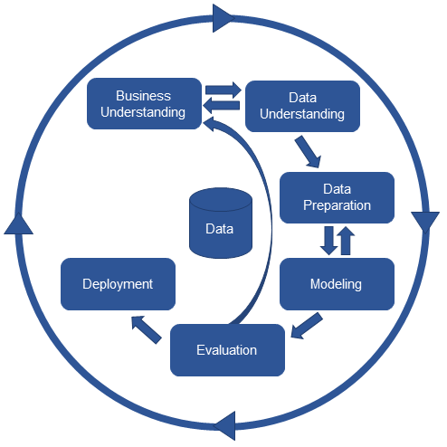

# Projeto Classificador de Música

[https://www.notion.so/daviaaze/Projeto-Classificador-de-M-sica-d5f6c4f219aa4a088e8877456d8d83f3](Este documento é uma cópia desta página do Notion)

# Metodologia utilizada

## CRISP-DM

### Etapas da metodologia utilizada

- Entendimento do negócio
    - Uma música é composta por vários elementos, dentre eles, melodia, instrumentação, letra, ritmo, etc.
    - Os seres humanos conseguem processar os estímulos de uma música, e diferenciá-los, de maneira muito rápida e eficiente, e, com treino, é possível descobrir um gênero musical em questão de segundos
    - Uma música sempre tem um gênero, e um gênero tem várias músicas, porem, para se classificar uma música, são utilizados diferentes fatores dependendo do contexto, podendo ser classificada por motivos: históricos, culturais, dependendo do contexto da região, da instrumentação, ritmo, melodia, e finalmente, a letra
    - Com a contextualização acima, é difícil definir um modelo que consiga processar todas essas informações e devolver o gênero correto, seria necessário utilizar diferentes métodos de processamento de dados, e procurar mais afundo como classificar músicas em diferentes gêneros.
    - Para a primeira fase desde projeto, irei desenvolver um sistema simples, que classifica as músicas utilizando somente a letra (dado primariamente fornecido no dataset).
    - Em futuras fases do projeto, posso adicionar ao conjunto de dados e possíveis features, dados que são minerados a partir do processamento de áudio, como taxa de cruzamento de zeros (Zero Crossing Rate), centróide espectral (Spectral Centroid), Rolloff Espectral(Spectral Rolloff) e outros.
- Entendimento dos dados
    - O dataset é bem simples, contendo apenas uma coluna (letra), e separado por gêneros musicais. Sendo assim, podemos unir tudo em um dataset que contenha uma coluna letra, e uma coluna gênero, que serão respectivamente features e alvo.
    - A **primeira coluna**, (lyric), contem um conjunto de palavras, sendo então, um conjunto de dados não estruturados. Tendo que se utilizar nela NLP para transforma-lá em um conjunto de dados utilizáveis no modelo. Este processo é complexo, pois existem diferentes maneiras de se limpar textos, e, cada caso necessita de limpezas especificas
    - já a **coluna de gêneros**, é somente uma coluna de classificação com 4 possíveis valores, que atualmente são palavras, podendo ser transformada futuramente em 4 colunas binárias, ou, transformar as palavras em valores únicos, e normaliza-las
    - Todos os gêneros tem o mesmo numero de colunas (800) (sem a remoção dos dados duplicados, depois deste processo, o dataset ainda continua bem uniforme, tendo variância máxima de 10 rows), facilitando processamento e separação de dados para treino e teste
- Preparação dos dados
    - A limpeza da primeira coluna, para a utilização do método de extração do texto se resume em retirar caracteres que podem atrapalhar a conversão para vetorização, como pontuações, duplos espaços e caracteres como '\n'
    - Para o processamento da primeira coluna (texto), utilizarei o método de TF-IDF para a extração, os documentos foram limpos utilizando a pipeline padrão de NLP, mais a remoção de acentos, e caracteres especiais

        A pipeline padrão de NLP consiste em:

        - Tokenizacão: Nesta etapa transformei meu documento em um array de palavras (ou um array de frases, mas, neste caso, utilizei o de palavras), para isso utilizei o método word_tokenize da biblioteca nltk
        - Remoção de Stop words: Nesta etapa utilizei o conjunto de palavras fornecidas pela biblioteca nltk para remover as stop words dos documentos
        - Stemming: Nesta etapa utilizei o método RSLPStemmer para fazer a stemmização das palavras em português, este método tambem pertence à biblioteca nltk
        - Normalização do texto: Acabei por não utilizar este método no processamento dos dados, tanto por dificuldade de implementação, quanto por ter atingido uma acurácia significativa sem o mesmo
    - Também foi testado o processamento através de Doc2Vec, porem a acurácia foi bem menos significativa (0.36)
- modelo
    - Foram testados dois modelos diferentes, regressão linear e Random Forest
    - O modelo de regressão logística se saiu bem nos primeiros testes, a escolha desse modelo foi devida a necessidade de predizer um de 4 valores diferentes. Também este modelo foi escolhido por lidar melhor com os dados transformados pelo TF-IDF, ele atingiu uma acurácia de 85% e um score F1 de 0.85
    - O modelo de random forest, sem nenhum parâmetro, atingiu uma acurácia de 82%
    - Com as declarações acima, para esta primeira versão, o modelo escolhido para a fase de tunning de hyperparametros e possivelmente para o deploy da ferramenta foi a regressão linear
- avaliação
    - Para a avaliação do modelo, foi utilizados acurácia, pois o dataset era uniforme, e os resultados não tinham pesos diferentes
    - também foi utilizado um k-fold com k = 5, pois 5 variações já dão uma precisão maior, e não tem um tempo tão grande de processamento
- Implantação
    - Para a implantação do modelo, foi utilizado o framework Flask, em REST. O modelo é bem simples, tendo apenas uma rota, em método post, os dados são trafegados em formato JSON para atender as demandas do React e por ser de fácil acesso
    - Já o Front-End, foi feito em React, pela possibilidade de se criar um SPA.

# Critérios do projeto

[análise exploratória do conjunto de dados de forma descritiva](Análise.md)

# Referências

[https://www.kdnuggets.com/2018/11/multi-class-text-classification-doc2vec-logistic-regression.html](https://www.kdnuggets.com/2018/11/multi-class-text-classification-doc2vec-logistic-regression.html)

[http://ijaerd.com/papers/finished_papers/A_review_of_feature_extraction_methods_for_text_classification-IJAERDV05I0489982.pdf](http://ijaerd.com/papers/finished_papers/A_review_of_feature_extraction_methods_for_text_classification-IJAERDV05I0489982.pdf)

[https://github.com/dipayandutta93/Music-Genre-Classification-using-lyrics](https://github.com/dipayandutta93/Music-Genre-Classification-using-lyrics)

[https://www.scielo.br/scielo.php?script=sci_arttext&pid=S0104-65002008000300002](https://www.scielo.br/scielo.php?script=sci_arttext&pid=S0104-65002008000300002)

[https://www.mariofilho.com/as-metricas-mais-populares-para-avaliar-modelos-de-machine-learning/](https://www.mariofilho.com/as-metricas-mais-populares-para-avaliar-modelos-de-machine-learning/)

[http://cursos.leg.ufpr.br/ML4all/apoio/reamostragem.html#validação_cruzada_k-fold](http://cursos.leg.ufpr.br/ML4all/apoio/reamostragem.html#valida%C3%A7%C3%A3o_cruzada_k-fold)

[https://medium.com/data-hackers/como-selecionar-as-melhores-features-para-seu-modelo-de-machine-learning-faf74e357913](https://medium.com/data-hackers/como-selecionar-as-melhores-features-para-seu-modelo-de-machine-learning-faf74e357913)

[http://www.each.usp.br/lauretto/SIN5008_2011/aula01/aula1#:~:text=A finalidade da Análise Exploratória,aplicação de qualquer técnica estatística.&text=Após a coleta e a,passo é a análise descritiva](http://www.each.usp.br/lauretto/SIN5008_2011/aula01/aula1#:~:text=A%20finalidade%20da%20An%C3%A1lise%20Explorat%C3%B3ria,aplica%C3%A7%C3%A3o%20de%20qualquer%20t%C3%A9cnica%20estat%C3%ADstica.&text=Ap%C3%B3s%20a%20coleta%20e%20a,passo%20%C3%A9%20a%20an%C3%A1lise%20descritiva).

[https://medium.com/ensina-ai/usando-machine-learning-para-limpeza-de-dados-d995e565ea1e](https://medium.com/ensina-ai/usando-machine-learning-para-limpeza-de-dados-d995e565ea1e)

[https://medium.com/matgonz/crisp-dm-na-prática-65be0ee92ada](https://medium.com/matgonz/crisp-dm-na-pr%C3%A1tica-65be0ee92ada)

[https://blog.bismart.com/en/classification-vs.-clustering-a-practical-explanation#:~:text=Although both techniques have certain,which differentiate them from other](https://blog.bismart.com/en/classification-vs.-clustering-a-practical-explanation#:~:text=Although%20both%20techniques%20have%20certain,which%20differentiate%20them%20from%20other)

[https://www.wrprates.com/processamento-de-linguagem-natural-nlp/#Casos_de_uso_e_onde_e_possivel_aplicar_o_Processamento_de_Linguagem_Natural](https://www.wrprates.com/processamento-de-linguagem-natural-nlp/#Casos_de_uso_e_onde_e_possivel_aplicar_o_Processamento_de_Linguagem_Natural)

[https://www.nltk.org/howto/portuguese_en.html](https://www.nltk.org/howto/portuguese_en.html)
